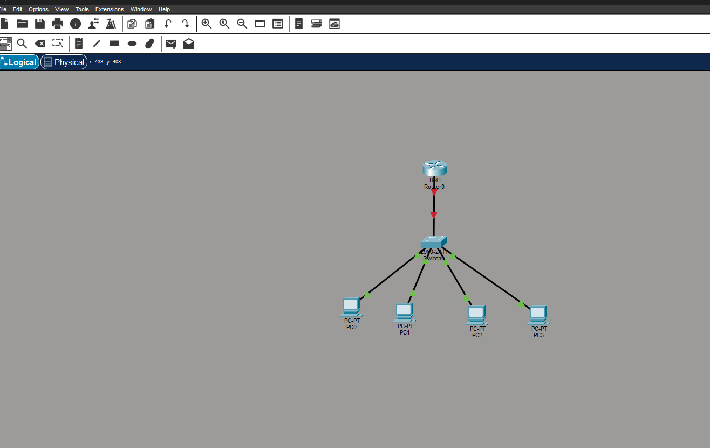
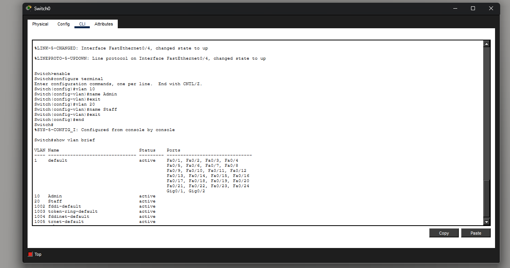
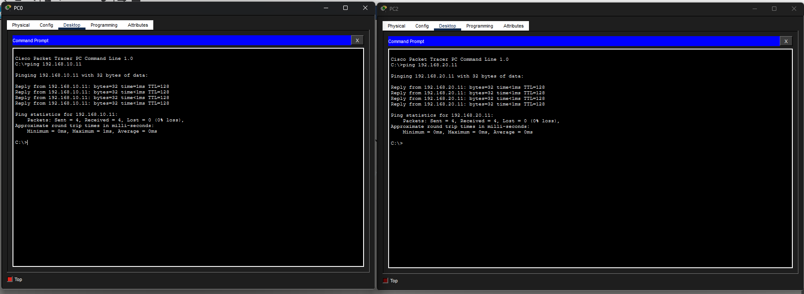
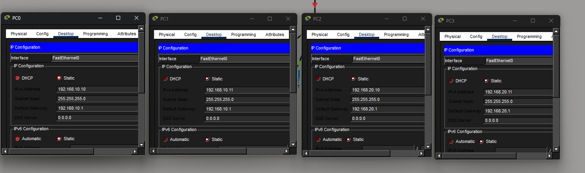

# Cisco Networking Home Lab (Packet Tracer)

## Overview
This project is a personal networking homelab built using Cisco Packet Tracer to simulate a small office environment. The lab focuses on foundational switching, VLAN configuration, inter-VLAN routing, and basic network security concepts commonly used in enterprise networks.

## Lab Description
A multi-PC network connected through Cisco switches and a router to demonstrate:
- VLAN segmentation
- Inter-VLAN routing
- Switch management
- Port security
- IP addressing and connectivity testing

## Network Topology
- Multiple PCs simulating office workstations
- Cisco Layer 2 switch
- Router-on-a-stick configuration for inter-VLAN routing
- Trunk and access ports

## Skills Practiced
- VLAN creation and management
- Inter-VLAN routing
- Switch configuration and management
- Port security implementation
- Static IP addressing and subnetting
- Network troubleshooting using ICMP (ping)

## Validation & Testing
- Verified inter-VLAN communication using ping
- Confirmed correct VLAN assignment and port configurations
- Tested connectivity and isolated VLAN traffic as expected

## Files Included
- `.pkt` file containing the complete lab topology and configurations
- Screenshots showing:
  - Network topology
  - VLAN configuration
  - Successful connectivity tests

## How to Run
1. Download and install Cisco Packet Tracer
2. Open the `.pkt` file located in the repository
3. Review switch and router configurations
4. Test connectivity between VLANs

## Screenshot of HomeLab

### Network Topology

### VLAN Configuration

### VLAN Assignmnet

### Static IP Assignment

### VLAN-COMMUNICATION

## Author
Erick Schwartz
